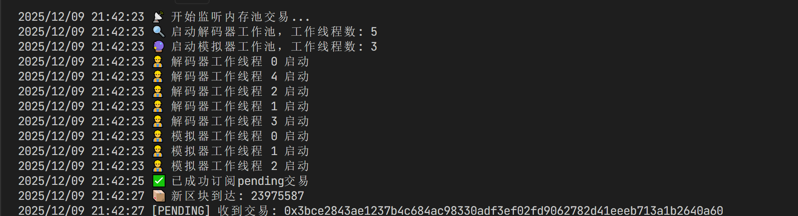
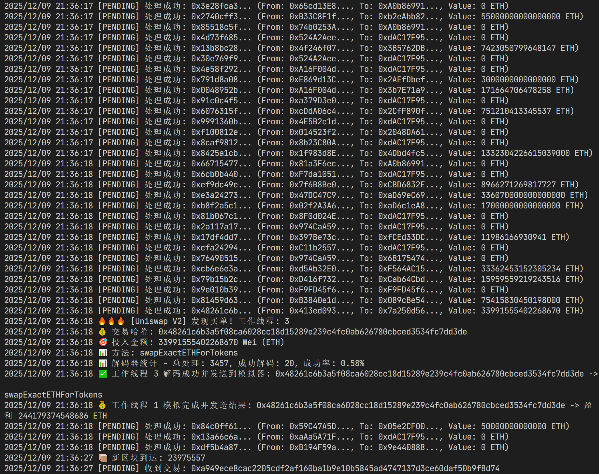
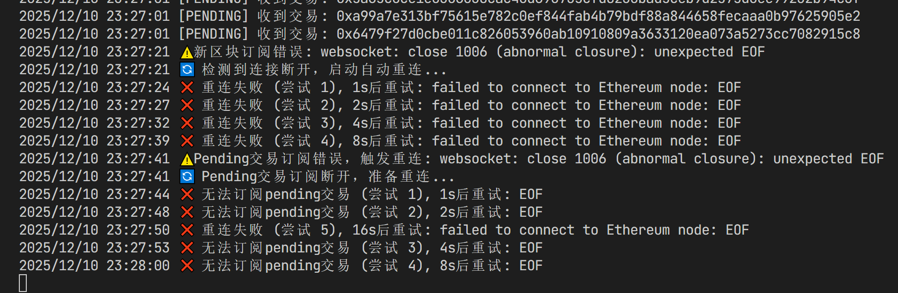
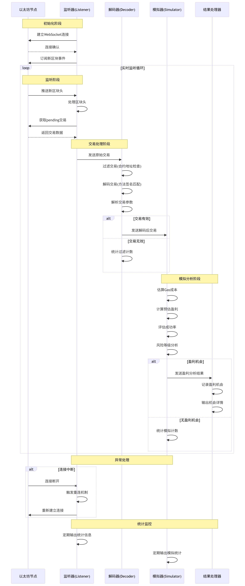

# Mempool Sniper 🔍

[](https://golang.org)
[](LICENSE)
[](https://ethereum.org)

> **MEV Searcher (MEV 搜索者) 的实战项目** - 实时监控以太坊内存池，识别盈利交易机会

Mempool Sniper 是一个高性能的以太坊内存池监控工具，能够实时检测待处理交易，识别潜在的套利机会，为量化交易和 MEV (矿工可提取价值) 研究提供技术支持。

## ✨ 特性

- 🔥 **实时监控** - 通过 WebSocket 连接以太坊节点，实时接收交易数据
- ⚡ **高性能** - 基于 Go 协程和通道的并发架构，处理高吞吐量交易流
- 🔍 **智能识别** - 支持多种 DEX 交易模式识别 (Uniswap, SushiSwap 等)
- 🧪 **本地模拟** - 内置交易模拟器，评估潜在盈利机会
- 📊 **可视化日志** - 醒目的日志输出，实时展示监控状态

## 运行截图






## � 快速开始

### 环境要求

- Go 1.24+
- 以太坊节点访问权限 (Infura/Alchemy 或本地节点)

### 安装

```bash
# 克隆项目
git clone https://github.com/your-username/mempool-sniper.git
cd mempool-sniper

# 安装依赖
go mod download
```

### 配置

复制环境变量模板文件并配置你的节点信息：

```bash
cp .env.example .env
```

编辑 `.env` 文件，配置以下参数：

```env
# 以太坊节点配置
ETH_WSS_URL=wss://mainnet.infura.io/ws/v3/YOUR_PROJECT_ID
ETH_RPC_URL=https://mainnet.infura.io/v3/YOUR_PROJECT_ID

# 狙击手配置
MIN_PROFIT=1000000000000000  # 最小盈利阈值 (wei)
MAX_GAS_PRICE=50000000000    # 最大 Gas 价格 (wei)
MAX_GAS_LIMIT=3000000        # 最大 Gas 限制

# 日志配置
LOG_LEVEL=info
LOG_FILE=./logs/mempool-sniper.log
```

### 运行

```bash
# 构建项目
go build -o mempool-sniper.exe ./cmd/mempool-sniper

# 运行程序
./mempool-sniper.exe
```

或者使用提供的脚本：

```bash
# Linux/Mac
./scripts/start.sh

# Windows
./scripts/start.bat
```

## 📁 项目架构

```
mempool-sniper/
├── cmd/mempool-sniper/     # 主程序入口
│   └── main.go
├── internal/               # 内部模块
│   ├── config/            # 配置管理
│   ├── listener/          # 交易监听器
│   ├── decoder/           # 交易解码器
│   └── simulator/         # 交易模拟器
├── pkg/types/             # 数据类型定义
├── scripts/               # 启动脚本
└── examples/              # 使用示例
```

### 数据流向



1. **监听器 (Listener)** - 订阅以太坊节点的 pending 交易
2. **解码器 (Decoder)** - 解析交易数据，识别 DEX 交互
3. **模拟器 (Simulator)** - 模拟交易执行，计算潜在盈利
4. **结果处理器** - 输出盈利机会和交易详情

## 🔧 核心模块

### 配置管理 (`internal/config`)

```go
// 加载配置
cfg, err := config.Load()
if err != nil {
    log.Fatal("配置加载失败:", err)
}
```

### 交易监听 (`internal/listener`)

```go
// 创建监听器
listener, err := listener.NewListener(cfg.Ethereum.WSSURL)

// 启动监听
go listener.Start(ctx, txChan)
```

### 交易解码 (`internal/decoder`)

```go
// 创建解码器
decoder := decoder.NewDecoder()

// 启动解码工作池
go decoder.StartWorkerPool(ctx, txChan, decodedTxChan, 5)
```

### 交易模拟 (`internal/simulator`)

```go
// 创建模拟器
simulator := simulator.NewSimulator(cfg.Ethereum.RPCURL)

// 启动模拟工作池
go simulator.StartWorkerPool(ctx, decodedTxChan, profitChan, 3)
```

## 💡 使用示例

查看 `examples/basic_usage.go` 了解基本用法：

```go
package main

import (
    "context"
    "log"
    "mempool-sniper/internal/config"
    "mempool-sniper/internal/listener"
)

func main() {
    // 加载配置
    cfg, err := config.Load()
    if err != nil {
        log.Fatal(err)
    }

    // 创建监听器
    listener, err := listener.NewListener(cfg.Ethereum.WSSURL)
    if err != nil {
        log.Fatal(err)
    }

    // 启动监控
    ctx := context.Background()
    txChan := make(chan *types.Transaction, 100)
    
    go listener.Start(ctx, txChan)
    
    log.Println("🚀 Mempool Sniper 启动成功")
    
    // 处理交易...
    for tx := range txChan {
        log.Printf("捕获交易: %s", tx.Hash().Hex())
    }
}
```

## 🛠️ 开发指南

### 添加新的 DEX 支持

1. 在 `internal/decoder/decoder.go` 中添加新的合约地址和方法签名
2. 实现对应的交易识别逻辑
3. 更新测试用例

### 自定义盈利策略

修改 `internal/simulator/simulator.go` 中的盈利计算逻辑，实现自定义的交易策略。

### 性能优化

- 调整工作池大小 (`internal/decoder` 和 `internal/simulator`)
- 优化通道缓冲区大小
- 使用本地节点减少网络延迟

## 🧪 测试

运行测试套件：

```bash
# 运行所有测试
go test ./...

# 运行特定模块测试
go test ./internal/decoder

# 运行基准测试
go test -bench=. ./internal/listener
```

## 🤝 贡献

欢迎提交 Issue 和 Pull Request！

1. Fork 本项目
2. 创建功能分支 (`git checkout -b feature/AmazingFeature`)
3. 提交更改 (`git commit -m 'Add some AmazingFeature'`)
4. 推送到分支 (`git push origin feature/AmazingFeature`)
5. 打开 Pull Request

## 📄 许可证

本项目采用 MIT 许可证 - 查看 [LICENSE](LICENSE) 文件了解详情。

## 🙏 致谢

- [go-ethereum](https://github.com/ethereum/go-ethereum) - 以太坊 Go 客户端
- 所有贡献者和用户

## 📞 联系我们

- 问题反馈: [GitHub Issues](https://github.com/your-username/mempool-sniper/issues)
- 讨论交流: [GitHub Discussions](https://github.com/your-username/mempool-sniper/discussions)

---